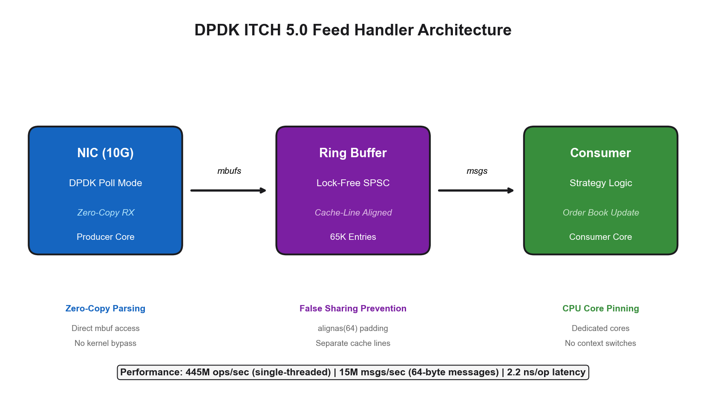
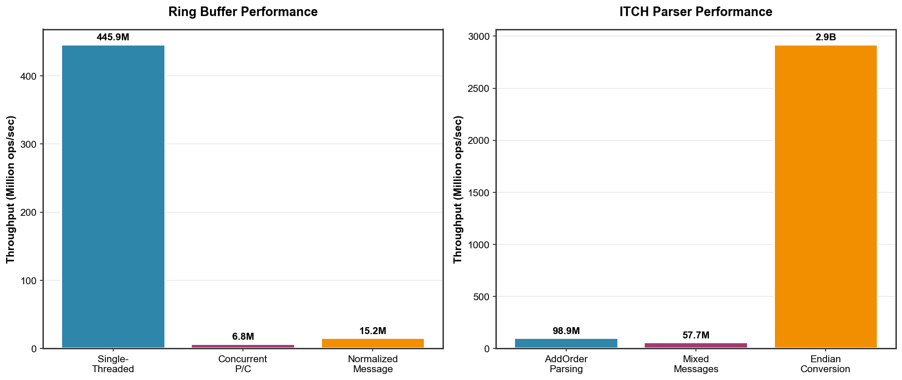
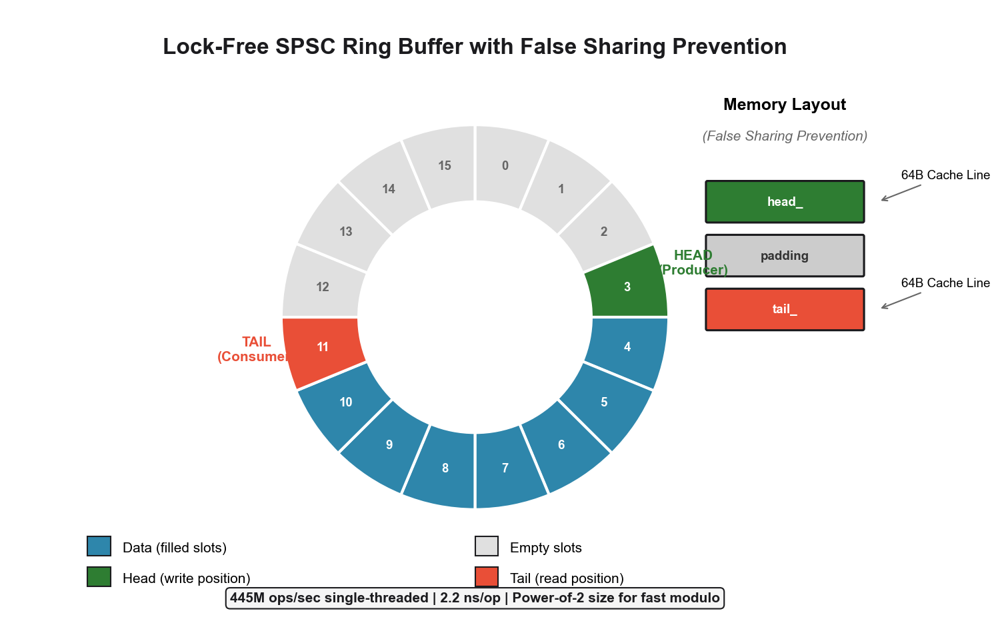
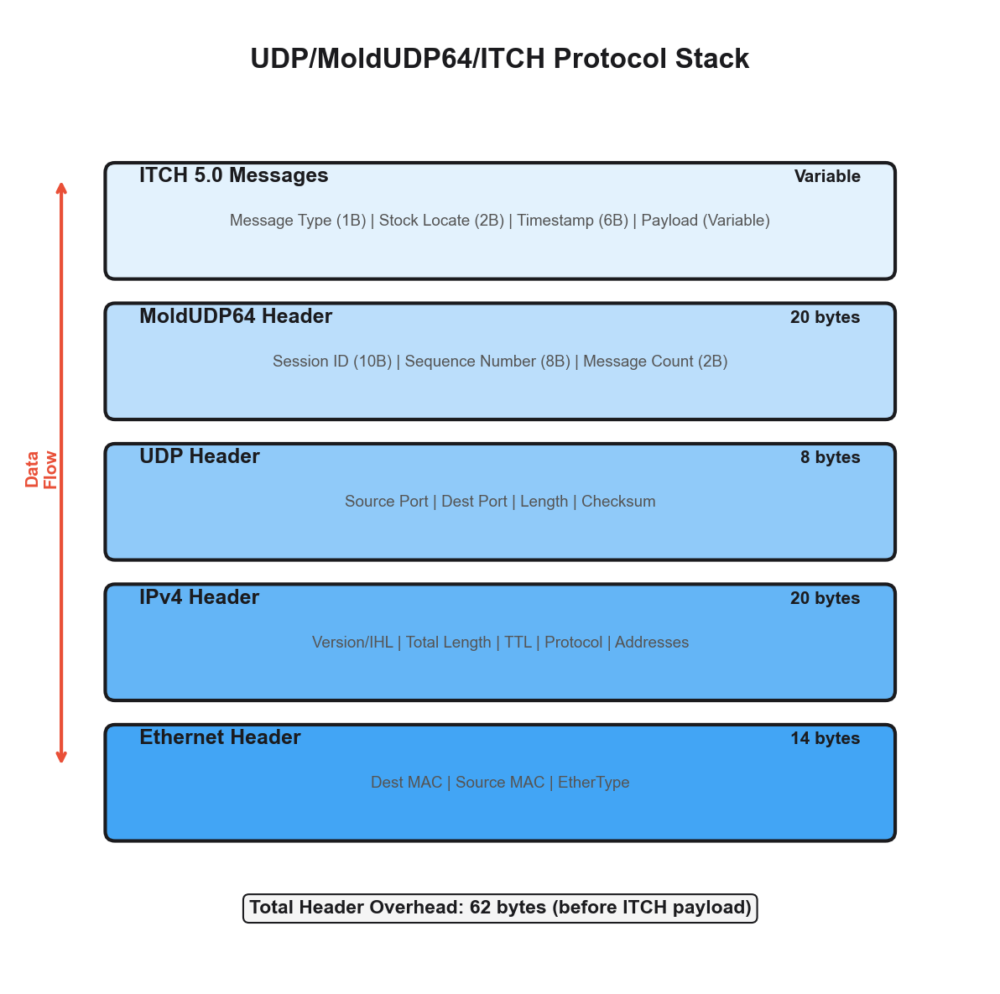

# DPDK ITCH 5.0 Feed Handler

A high-performance, kernel-bypass market data feed handler for NASDAQ TotalView-ITCH 5.0 protocol using DPDK (Data Plane Development Kit).

## Features

- **Zero-Copy Packet Parsing**: Direct pointer casting from DPDK mbufs without memory copies
- **Lock-Free SPSC Ring Buffer**: Cache-line aligned producer/consumer queue with false sharing prevention
- **MoldUDP64 Session Layer**: Full sequence tracking with gap detection
- **ITCH 5.0 Protocol Support**: All 22 message types with proper endianness handling
- **CPU Core Pinning**: Dedicated cores for packet reception and message processing
- **Hugepage Memory**: 2MB/1GB hugepage support for optimal memory access

## Architecture



## Project Structure

```
dpdk-itch5-feedhandler/
├── include/
│   ├── common/
│   │   ├── types.hpp          # Common type definitions
│   │   └── endian.hpp         # Byte-swapping utilities
│   ├── itch5/
│   │   ├── messages.hpp       # ITCH 5.0 message structures
│   │   └── parser.hpp         # Zero-copy parser
│   ├── moldudp64/
│   │   ├── header.hpp         # MoldUDP64 header parsing
│   │   └── session.hpp        # Session management & gap detection
│   ├── spsc/
│   │   └── ring_buffer.hpp    # Lock-free SPSC ring buffer
│   └── dpdk/
│       ├── config.hpp         # DPDK configuration
│       └── packet_handler.hpp # Packet processing
├── src/
│   ├── main.cpp               # Main application
│   └── feed_handler.hpp       # Feed handler implementation
├── tests/
│   ├── test_ring_buffer.cpp   # Ring buffer unit tests
│   ├── test_parser.cpp        # Parser unit tests
│   ├── test_moldudp64.cpp     # MoldUDP64 unit tests
│   ├── bench_ring_buffer.cpp  # Ring buffer benchmarks
│   └── bench_parser.cpp       # Parser benchmarks
├── scripts/
│   ├── setup_dpdk_env.sh      # DPDK environment setup
│   └── itch_to_pcap.py        # ITCH to PCAP converter
├── CMakeLists.txt
└── README.md
```

## Building

### Prerequisites

- CMake 3.16+
- C++17 compatible compiler (GCC 8+, Clang 7+)
- DPDK 21.11+ (optional, for live capture)

### Build without DPDK (File/PCAP mode)

```bash
mkdir build && cd build
cmake ..
make -j$(nproc)
```

### Build with DPDK

```bash
mkdir build && cd build
cmake -DUSE_DPDK=ON ..
make -j$(nproc)
```

### Run Tests

```bash
cd build
ctest --output-on-failure
```

### Run Benchmarks

```bash
./bench_ring_buffer
./bench_parser
```

## Usage

### Process ITCH Binary File

```bash
./feed_handler --itch-file 01302019.NASDAQ_ITCH50 --stats
```

### Process PCAP File

```bash
./feed_handler --pcap-file nasdaq_data.pcap --stats
```

### Live Capture (requires DPDK)

```bash
# Setup DPDK environment (as root)
sudo ./scripts/setup_dpdk_env.sh setup
sudo ./scripts/setup_dpdk_env.sh bind eth1

# Run feed handler
./feed_handler --port 0 --producer-core 1 --consumer-core 2
```

### Convert ITCH to PCAP

```bash
python3 scripts/itch_to_pcap.py input.itch output.pcap
```

## ITCH 5.0 Message Types Supported

| Type | Message | Size |
|------|---------|------|
| S | System Event | 12 |
| R | Stock Directory | 39 |
| H | Stock Trading Action | 25 |
| Y | Reg SHO Restriction | 20 |
| L | Market Participant Position | 26 |
| V | MWCB Decline Level | 35 |
| W | MWCB Status | 12 |
| K | IPO Quoting Period | 28 |
| J | LULD Auction Collar | 35 |
| h | Operational Halt | 21 |
| A | Add Order (No MPID) | 36 |
| F | Add Order (MPID) | 40 |
| E | Order Executed | 31 |
| C | Order Executed With Price | 36 |
| X | Order Cancel | 23 |
| D | Order Delete | 19 |
| U | Order Replace | 35 |
| P | Trade (Non-Cross) | 44 |
| Q | Cross Trade | 40 |
| B | Broken Trade | 19 |
| I | NOII | 50 |
| N | RPII | 20 |

## Performance Results

### Benchmark Environment

| Parameter | Value |
|-----------|-------|
| **CPU** | Apple M-series (12 cores @ 2.6 GHz) |
| **L1 Cache** | 32 KiB (Data) |
| **L2 Cache** | 256 KiB |
| **Compiler** | Apple Clang 17.0.0 |
| **Build** | Release (-O3) |

---

### Lock-Free SPSC Ring Buffer

| Benchmark | Operations | Throughput | Latency |
|-----------|------------|------------|---------|
| **Single-Threaded** | 10,000,000 | **445.95 million ops/sec** | 2.2 ns/op |
| **Concurrent P/C** | 10,000,000 | 6.79 million ops/sec | 147 ns/op |
| **NormalizedMessage (64 bytes)** | 10,000,000 | **15.19 million msgs/sec** | 65.8 ns/msg |

#### Latency Distribution (Concurrent Producer/Consumer)

| Metric | Value |
|--------|-------|
| **Samples** | 100,000 |
| **Min** | 132 ns |
| **Max** | 350,277 ns |
| **Mean** | 137,409 ns |
| **P50 (Median)** | 100,526 ns |
| **P90** | 291,017 ns |
| **P99** | 348,274 ns |
| **P99.9** | 349,599 ns |

---

### ITCH 5.0 Parser

| Benchmark | Messages | Throughput | Bandwidth | Latency |
|-----------|----------|------------|-----------|---------|
| **AddOrder Parsing** | 10,000,000 | **98.87 million msgs/sec** | 3.56 GB/sec | 10.1 ns/msg |
| **Mixed Messages** | 31,936 | 57.73 million msgs/sec | 1.90 GB/sec | 17.3 ns/msg |
| **Zero-Copy Casting** | 10,000,000 | 123.74 million msgs/sec | — | 8.08 ns/msg |
| **Endian Conversion** | 100,000,000 | **2.92 billion swaps/sec** | — | 0.34 ns/swap |

#### Mixed Message Distribution

| Message Type | Count | Percentage |
|--------------|-------|------------|
| AddOrder | 19,232 | 60.2% |
| OrderExecuted | 9,570 | 30.0% |
| OrderDelete | 3,134 | 9.8% |



---

### Test Results

```
=== Ring Buffer Tests ===
PASS: test_basic_operations
PASS: test_full_buffer
PASS: test_empty_buffer
PASS: test_power_of_two_size
PASS: test_size_tracking
PASS: test_reset
PASS: test_normalized_message

=== ITCH Parser Tests ===
PASS: test_add_order_parsing
PASS: test_order_executed_parsing
PASS: test_order_delete_parsing
PASS: test_trade_parsing
PASS: test_system_event_parsing
PASS: test_stock_directory_parsing
PASS: test_callback_invocation
PASS: test_buffer_parsing
PASS: test_parse_stats
PASS: test_unknown_message_type

=== MoldUDP64 Session Layer Tests ===
PASS: test_header_size
PASS: test_header_parsing
PASS: test_heartbeat_detection
PASS: test_end_of_session
PASS: test_session_initial_state
PASS: test_session_normal_operation
PASS: test_session_gap_detection
PASS: test_session_heartbeat_handling
PASS: test_session_multiple_gaps
PASS: test_session_reset
PASS: test_session_is_healthy
PASS: test_truncated_packet

=== Results ===
Passed: 29
Failed: 0
```

## Key Design Decisions

### Lock-Free Ring Buffer Design



### False Sharing Prevention

```cpp
struct RingBuffer {
    alignas(64) std::atomic<size_t> head_;  // Producer's cache line
    char padding_[64 - sizeof(std::atomic<size_t>)];
    alignas(64) std::atomic<size_t> tail_;  // Consumer's cache line
};
```

### Zero-Copy Parsing

```cpp
// Cast directly to struct - no memcpy
auto* msg = reinterpret_cast<const AddOrder*>(packet_data + offset);
uint64_t order_ref = endian::ntoh64(msg->order_reference_number);
```

### Endianness Handling

```cpp
// Use compiler intrinsics for single-instruction swap
inline uint32_t swap32(uint32_t val) noexcept {
    return __builtin_bswap32(val);  // Maps to BSWAP instruction
}
```

### Price Representation

```cpp
// Store prices as fixed-point integers to avoid floating-point
using Price = int64_t;  // 6 decimal places
constexpr int64_t PRICE_SCALE = 1'000'000;
// $150.25 stored as 150250000
```

## Sample Data

Download NASDAQ ITCH 5.0 sample data:
- Search for "NASDAQ ITCH 5.0 sample" or
- Use files from open-source repositories like `justinabate/nasdaq_itch_pcap`

## DPDK Environment Setup

The `setup_dpdk_env.sh` script handles:

1. **Hugepage Allocation**: 2MB and 1GB pages
2. **CPU Isolation**: Dedicated cores for polling
3. **Module Loading**: vfio-pci or igb_uio
4. **Interface Binding**: Bind NIC to DPDK driver

```bash
# Full setup
sudo ./scripts/setup_dpdk_env.sh setup

# Check status
./scripts/setup_dpdk_env.sh status

# Bind interface
sudo ./scripts/setup_dpdk_env.sh bind eth1
```

## UDP/MoldUDP64 Protocol Stack



## Gap Detection

The MoldUDP64 session layer tracks sequence numbers:

```cpp
if (header.sequence_number > expected_sequence_) {
    // Gap detected! Request retransmission
    Gap gap{expected_sequence_, header.sequence_number - 1};
    notify_gap(gap);
    state_ = SessionState::Stale;
}
```

## License

MIT License

## References

- [NASDAQ TotalView-ITCH 5.0 Specification](https://www.nasdaqtrader.com/content/technicalsupport/specifications/dataproducts/NQTVITCHspecification.pdf)
- [MoldUDP64 Protocol Specification](https://www.nasdaqtrader.com/content/technicalsupport/specifications/dataproducts/moldudp64.pdf)
- [DPDK Documentation](https://doc.dpdk.org/)
